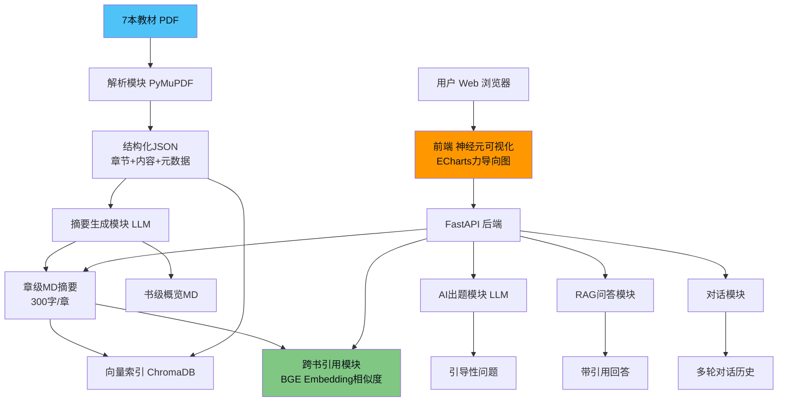

# Agent 架构说明

## 1. 架构总览

### 设计理念：神经元探索模型

本系统采用**单 Agent + 神经元探索**架构。将7本医学教材抽象为7个"神经元起点"，用户通过点击神经元展开章节，AI生成引导性问题驱动深入探索。跨教材关联自动以"突触连接"形式呈现。



### 模块职责

| 模块 | 职责 | 技术 |
|------|------|------|
| pdf_parser | PDF教材结构化解析（章节识别、页眉页脚过滤） | PyMuPDF |
| summary_builder | 逐章生成300字摘要MD + 书级概览 | DeepSeek LLM |
| question_gen | 基于章节摘要生成4-5个引导性探索问题 | DeepSeek LLM |
| cross_ref | 跨教材章节语义关联发现 | BGE-small-zh Embedding |
| rag_engine | 原文分块→向量化→检索→生成带引用回答 | ChromaDB + BGE + DeepSeek |
| dialogue | 多轮对话，教师可讨论整合决策 | DeepSeek LLM |

## 2. 设计决策论证

### 为什么选择"神经元探索"而非传统知识图谱？

**核心问题**：7本医学教材2500+页、100万+字，传统KG需要逐章调用LLM提取知识点（70+次调用），每次提取+关系识别耗时20-40秒，总耗时30-50分钟——5小时比赛不可承受。

**我们的方案**：
- 预生成章节摘要MD（每章1次LLM调用，300字浓缩）→ 70章约10-15分钟
- 用户点击时才加载摘要并生成问题（按需计算，延迟分散到交互中）
- 跨书引用用Embedding一次性计算（秒级），无需LLM参与

**关键权衡**：

| 维度 | 传统KG方案 | 神经元探索方案 |
|------|-----------|---------------|
| LLM调用次数 | 70章×2次=140次 | 70章×1次(摘要)+按需出题 |
| 初始化时间 | 30-50分钟 | 10-15分钟 |
| 知识粒度 | 节点级（1500-2500节点） | 章节级（~70章摘要） |
| 交互体验 | 静态图谱浏览 | 游戏化探索+AI引导 |
| 跨教材关联 | 需要额外LLM判定 | Embedding秒级计算 |
| 可扩展性 | 新增教材需重建KG | 新书只需跑摘要 |

### 为什么是单 Agent？

任务本质是**顺序管道**（解析→摘要→索引→探索），无并行需求。拆分为多Agent只会引入通信开销和调试复杂度，在5小时限制下得不偿失。

**Prompt复杂度管理**：每个模块的Prompt职责单一——
- 摘要Prompt：只概括章节内容
- 出题Prompt：只生成引导问题
- 问答Prompt：只用上下文回答+强制引用
- 对话Prompt：只讨论整合决策

### 为什么选择 BGE-small-zh-v1.5？

- 中文语义理解优秀（MTEB中文榜单前列）
- 本地运行零API费用
- 模型仅100MB，启动快
- 章节摘要仅300字，BGE能精确捕捉语义相似度

## 3. 数据流与调用链路

### 初始化流程

```
上传PDF → parse-all (PyMuPDF逐页解析)
        → summarize-all (LLM逐章生成300字MD)
        → index-all (BGE向量化所有chunk+摘要 → ChromaDB)
        → 前端加载7本教材列表 → 渲染7个神经元节点
```

### 探索流程

```
用户点击神经元(教材) → 章节列表展开为子节点
用户点击章节 → GET /api/explore/{book}/{chapter}
  → 读取预生成摘要MD (秒级)
  → LLM生成引导问题 (3-5秒)
  → Embedding跨书引用查询 (秒级)
  → 返回: 摘要+问题+跨书引用+探索路径
用户点击问题 → POST /api/ask
  → BGE向量化问题 → ChromaDB检索top-5
  → LLM生成带引用回答
  → 返回: 回答+引用来源列表
```

### 关键API接口

| 端点 | 方法 | 说明 |
|------|------|------|
| `/api/books` | GET | 所有教材及章节结构 |
| `/api/books/parse-all` | POST | 一键解析所有教材 |
| `/api/books/summarize-all` | POST | 一键生成所有摘要 |
| `/api/books/index-all` | POST | 一键建立向量索引 |
| `/api/explore/{tid}/{cid}` | GET | 探索章节（摘要+问题+引用） |
| `/api/ask` | POST | RAG问答 |
| `/api/dialogue` | POST | 多轮对话 |
| `/api/report` | GET | 整合报告 |
| `/api/status` | GET | 系统状态 |

## 4. RAG Pipeline 设计

### 分块策略

- **块大小**：600字（中文教材自然段落500-800字的中位数）
- **重叠**：100字（2-3句话，防知识点边界截断）
- **按句号/换行切分**：保证语义完整
- **双层索引**：原文chunk + 章节摘要同时入向量库

### 检索策略

单路向量检索（BGE余弦相似度），top-5。检索范围同时覆盖原文chunk和章节摘要，摘要命中时返回更精准的上下文。

### 引用强制

Prompt明确要求：`[教材名, 第X章, 第X页]`格式，每个chunk保存来源元数据。

## 5. Prompt 工程

### 防幻觉策略

1. **格式锁定**：出题用严格JSON数组，解析失败则fallback默认问题
2. **角色约束**：RAG生成限制"只用提供的上下文"
3. **强制引用**：格式模板`[教材名, 第X章, 第X页]`
4. **无答案兜底**："当前知识库中未找到相关信息"

### 关键Prompt模板

**摘要生成**：300字概括，含3-5个核心知识点+主要内容脉络

**问题生成**：4-5个问题，覆盖4种类型（概念理解/机制解释/对比分析/临床应用）

**RAG生成**：严格限制上下文使用+强制引用格式+无答案兜底

## 6. 已知局限与改进方向

### 当前局限

1. **章节粒度**：探索以章节为单位，无法做到知识点级精细化
2. **图表丢失**：PDF中的解剖图、病理切片图信息丢失
3. **单路检索**：仅向量检索，缺少BM25关键词互补
4. **无Rerank**：检索后直接取top-5
5. **状态仅内存**：服务重启后探索路径丢失

### 如果有更多时间

1. 引入知识点级提取（在摘要基础上做second-pass）
2. BM25+向量混合检索+Cross-Encoder Rerank
3. SQLite持久化探索路径
4. 自建RAG Benchmark对比不同策略
5. 知识图谱多视图（力导向图+树状图+矩阵热力图）

## 7. 创新点

### 7.1 神经元探索模型

**做了什么**：将7本教材设计为7个"神经元起点"，用户点击展开章节、AI出题引导探索、跨书引用如"突触连接"般自动关联。

**为什么做**：传统静态知识图谱对于2500页教材不现实（LLM调用成本过高），交互式探索将计算分散到用户交互中，5小时内可跑通全流程。

**效果**：初始化时间从传统KG的30-50分钟降至10-15分钟，用户交互响应在3-5秒内。

### 7.2 按需计算 + 预生成混合策略

**做了什么**：摘要预生成（一次性成本），问题按需生成（分散到交互中），跨书引用用Embedding（秒级）。

**为什么做**：最大化利用"用户阅读时间"做后台计算，避免初始化阶段阻塞整个系统。

---

**文档版本**：v2.0
**最后更新**：2026-05-10
